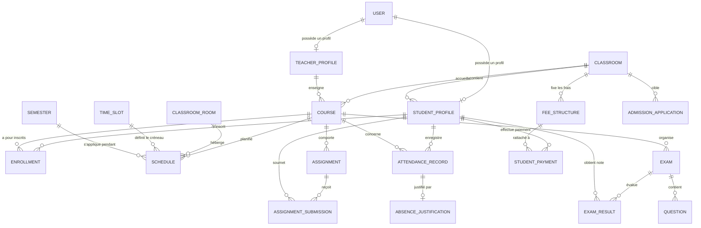

# Schéma Entité-Association (ER Diagram) - Système de Gestion d'École

Ce document présente l'architecture de la base de données relationnelle PostgreSQL pour la plateforme scolaire.

## Description des Tables Clés

1. **`accounts_user`** : Modèle d'utilisateur personnalisé supportant les rôles (`ADMIN`, `TEACHER`, `STUDENT`, `PARENT`).
2. **`students_studentprofile`** : Profil des élèves avec matricule unique `student_number`.
3. **`teachers_teacherprofile`** : Profil des enseignants avec matricule `employee_id`.
4. **`trs_schedule`** : Table d'emploi du temps imposant un anti-chevauchement strict par contraintes d'unicité et validation de modèle (`clean()`).
5. **`finance_studentpayment`** : Enregistrement des règlements bancaires / Mobile Money avec protection contre la suppression si le reçu est émis (`is_receipt_issued = True`).
6. **`exams_examresult`** : Notes sur 20 avec calcul de moyennes dans le bulletin.
